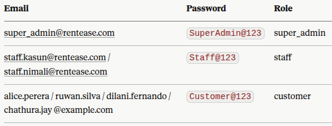

# RentEase — MVP Specification (v2, as-built)

*This is a revision of the original MVP specification, updated to match the system that is actually implemented in the repository as of this build, not the one that was planned before coding started. Where the build diverged from the original plan — one feature removed, several security/ops details added that weren't originally specified — those changes are called out explicitly with a short "why" rather than silently edited in, so the history isn't lost. Everything still marked "Deferred" below genuinely isn't built yet.*

---

## 1. Business Background

*(Unchanged from v1.)* We run a rental company that rents out physical items to customers — vehicles, equipment, or property. Bookings used to happen over phone/WhatsApp, causing double-bookings and no central record. The MVP replaces that with a single source of truth for availability and bookings. The customer physically visits the branch to collect and return the item.

---

## 2. MVP Goal

*(Unchanged.)* Stop double-bookings by giving customers real-time availability and a self-service booking + payment flow, and giving staff one place to see and manage those bookings.

- Customers can browse available items, check real availability, and book/pay online.
- Staff can view bookings, confirm/cancel them, and record payments from one dashboard.
- Mobile-friendly.

> **Deferred (not MVP):** Owner-facing analytics/reporting, utilization dashboards, overdue-item alerts.

---

## 3. User Roles (as built)

| Role | Description |
|---|---|
| **Guest** | Browses the public site without an account. |
| **Customer** | Registered user. Books, pays, views booking history, cancels within the fixed policy (§4.3). |
| **Staff** | Confirms/cancels bookings, manages inventory, records payments. Cannot create/deactivate other staff accounts. |
| **Super Admin (Owner)** | Everything Staff can do, plus creating, deactivating, and reactivating Staff/Super Admin accounts, and recording manual (cash/bank-transfer) payments and refunds. |

**Change from v1:** the original spec described Staff and Super Admin as differing only in staff-account management. The build adds one more split: **manual payment/refund recording is Super Admin-only** — Staff can view the full payments ledger but the "Record manual payment" action, both in the UI and enforced independently server-side, is restricted to Super Admin. Also added: **account reactivation** (`POST /admin/staff/{id}/reactivate`), not just deactivation, so a mistaken deactivation doesn't require a database fix.

> **Deferred (not MVP):** Splitting Staff into Booking Agent / Inventory Manager / Finance / Admin.

---

## 4. Customer-Facing Website — as built

### 4.1 Browsing & Search

*(Unchanged from v1 — implemented as specified.)*
- Home page listing available items; category filter; keyword search.
- Availability search by date range.
- Item detail page: photos, description, price, live availability.

> **Deferred (not MVP):** Autocomplete search, location/branch filters, price-range/capacity filters, promotions, reviews/ratings.

### 4.2 Booking Flow

- Customer selects item + date range.
- System shows price breakdown: base rate × duration + deposit (`GET /items/{id}/quote`).
- Customer logs in or registers (email + password).
- ~~Customer uploads one verification document (e.g., ID).~~ **Removed — see §4.2.1 below.**
- Payment: full payment online via Stripe Checkout.
- Booking confirmation page + confirmation email (sent over real SMTP via a Celery worker, not just logged) with a booking reference number.
- Booking appears in the customer's "My Bookings" list.

**Checkout is now Review → Pay**, with no step in between.

#### 4.2.1 Removed: ID/document verification step

The original spec (and an earlier version of the build) included a blocking "upload an ID document" step in checkout, plus a `documents` table and an admin approve/reject screen (§5.4 of v1). This has been **removed in full** from the current build:

- No `documents` table, model, schema, or routes exist. A fresh run of `docs/01_schema.sql` does not create this table.
- The admin Customers screen (§5.4 below) is a plain searchable list — there's no pending-document-review section.
- Item **catalog photos** (a separate, unrelated feature used by staff to manage listing images) are unaffected and still work via the presigned-MinIO-URL pattern.

This is a genuine scope change, not an oversight — flagging it here so it isn't silently reintroduced by someone building against the original spec. If ID verification is wanted later, it should be re-scoped as a Phase 2 item with a decision on *why* it's needed (compliance? fraud prevention?) rather than restored as-is.

#### 4.2.2 Payments — actual behavior

- `POST /payments/checkout/{booking_id}` creates a real `stripe.checkout.Session` and returns its URL; the customer is redirected to Stripe-hosted checkout. There is currently **no local "mock checkout" fallback in the code** — every checkout attempt calls Stripe directly, so a placeholder `STRIPE_SECRET_KEY` will fail the request with a 502 rather than substitute a fake payment page. *(Note: the repo's README describes a mock-checkout page and a `/payments/mock-complete/{id}` endpoint; neither exists anywhere in `apps/api` or the frontend code as of this build — that part of the README is aspirational and should either be implemented or corrected.)*
- Payment confirmation happens two ways, whichever lands first, both idempotent: the Stripe **webhook** (`POST /payments/webhook`, signature-verified) is the durable source of truth; a **sync check** (`GET /payments/checkout/{id}/sync`) on the success-page redirect gives the customer an immediate "confirmed" state without waiting on the webhook.
- A successful payment moves the booking `pending → confirmed` through the same state machine staff use, and triggers the confirmation email.

> **Deferred (not MVP):** Add-ons, partial deposit + pay-remainder-on-pickup, social login, local payment wallets, SMS confirmations.

### 4.3 Customer Account Area

- My Bookings: list with status; booking detail (dates, amount, status).
- **Cancel is available for `pending`/`confirmed` bookings and always succeeds** — cancellation and refund eligibility are enforced as separate concerns, exactly as originally specified:
  - ≥48 hours before pickup (`start_datetime`) → full refund.
  - <48 hours before pickup → booking still cancels, no refund.
  - This window is a code constant (`CANCELLATION_WINDOW_HOURS = 48` in `booking_service.py`), not yet an admin-configurable setting.
- Refund execution (`refund_service.py`): for a card payment, a real `stripe.Refund.create(...)` is attempted against the original PaymentIntent; if that fails or the original payment was cash/bank-transfer, a `refund` row is recorded as `pending`/`failed` for manual follow-up on the admin Payments screen. Refunds are idempotent — cancelling twice never double-refunds.
- **Correction vs. the repo's own README:** staff-initiated cancellations from the admin dashboard go through the exact same `cancel_booking()` function and the same 48-hour policy as customer cancellations — there is no separate, policy-free staff cancellation path in the code, regardless of what any prior documentation said.

> **Deferred (not MVP):** Downloadable invoices, handover/return photos, saved payment methods, support chat, notification preferences, loyalty codes.

### 4.4 Other Public Pages

*(Unchanged.)* About Us, Terms & Conditions, Privacy Policy, Contact Us — static.

---

## 5. Admin Dashboard — as built

### 5.1 Dashboard Home

`GET /admin/dashboard/summary` returns three counts for today: pickups (bookings starting today with status `confirmed`/`active`), returns (bookings ending today with status `active`), and active rentals. Matches spec as originally written.

> **Deferred:** Revenue widgets, occupancy/utilization rates, overdue alerts, low-availability alerts.

### 5.2 Inventory Management

Two-level model, as originally designed:
- **Catalog** (`item_catalog` + `item_photos`): the product — category, photos. `GET/POST /admin/items/catalog`, `POST /admin/items/catalog/{id}/photos/presign` + `POST .../photos` (MinIO presigned-URL upload), `DELETE /admin/items/catalog/photos/{id}`.
- **Items** (physical units): `GET/POST /admin/items`, `PATCH/DELETE /admin/items/{id}` — name, description, branch, base daily price, deposit, status (available/rented/maintenance/retired).
- `GET /admin/items/categories` was added (not in v1) — needed so staff can pick a category when creating a catalog entry instead of guessing an ID.

> **Deferred:** Seasonal/weekend pricing rules, maintenance scheduling with cost logs, bulk CSV import.

### 5.3 Booking Management

- `GET /admin/bookings` with `status_filter`, `start_from`/`start_to` filters.
- `POST /admin/bookings` — manual booking creation for phone/walk-in customers, going through the same availability-lock logic as the public flow (no separate, weaker code path).
- `GET /admin/bookings/{id}` — full detail.
- `POST /admin/bookings/{id}/status` — status transitions enforced by the same state machine as the customer side (`pending → confirmed → active → completed`, or `→ cancelled` from `pending`/`confirmed`/`active`); a `cancelled` target routes through the same refund-eligibility logic as §4.3.

> **Deferred:** Full drag-to-reschedule calendar, handover/return checklists with photos, damage flagging, late-fee automation.

### 5.4 Customer Management

- `GET /admin/customers?q=` — search by name/email, with booking counts.
- `GET /admin/customers/{id}/bookings` — a customer's booking history.
- **No document verification screen** — removed along with the upload step, see §4.2.1.

> **Deferred:** VIP/blacklist flags, CRM tags, communication log, support ticketing.

### 5.5 Payments

- `GET /admin/payments` — full transaction ledger, viewable by Staff and Super Admin.
- `POST /admin/payments` — manual payment/refund recording (cash/bank transfer), **Super Admin only**, enforced both in the UI and independently in the API (see §3).

> **Deferred:** Refund workflow automation beyond what §4.3 already does, invoice PDF generation, exportable reports.

### 5.6 Staff & Roles

- `GET/POST /admin/staff` — Super Admin lists/creates Staff or Super Admin accounts. New-account passwords go through the same server-side strength check as customer registration (8+ chars, letter + digit, common-password rejection), regardless of what the frontend already validated.
- `POST /admin/staff/{id}/deactivate` and `POST /admin/staff/{id}/reactivate` — both added in the build; v1 only specified deactivation.

> **Deferred:** Branch assignment, granular per-role permissions, admin UI for `audit_logs` (still captured in the DB, no screen yet).

### 5.7 Content & Settings

*(Unchanged — still entirely deferred.)* MVP hardcodes cancellation policy (48h) and tax rate (`TAX_RATE`, currently `0.0`) in application config (`core/config.py`), not in the database.

---

## 6. Security & Auth — added detail not in v1

The original spec's non-functional requirements (§6) mentioned RBAC and tokenized payments only in general terms. The build adds specifics worth capturing here since they're load-bearing:

- **JWT-based auth**, separate cookie scopes for the customer app and the admin app (`ACCESS_TOKEN_EXPIRE_MINUTES = 60`; `REFRESH_TOKEN_EXPIRE_DAYS = 7` for customers, shortened for the admin app).
- **Account lockout:** 5 consecutive failed login attempts (`MAX_LOGIN_ATTEMPTS`) locks the account for 15 minutes (`LOCKOUT_MINUTES`), tracked per-user via `failed_login_attempts`/`locked_until` columns on `users` — columns that exist in the build but were not in the v1 schema. Applies identically to customer and staff/admin login.
- **Password policy:** minimum 8 characters, at least one letter and one digit, common passwords rejected — enforced server-side in both registration paths, independent of client-side validation.
- **Row-level ownership checks** remain layered on top of role checks (e.g., a customer fetching `/bookings/{id}` gets a 404, not a 403, if it isn't theirs — avoids confirming the booking ID exists to someone who doesn't own it).
- **`COOKIE_SECURE` is currently `False`** in local dev config because this stack has no HTTPS anywhere yet — needs to flip to `True` (and the whole stack put behind real HTTPS) before any non-local deployment. This is a genuine pre-production gap, not a style choice, and should stay visible until it's closed.

---

## 7. Database Design (as built)

**Ten tables**, not eleven — `documents` has been dropped (see §4.2.1). Everything else matches the v1 design with a few added columns.

#### users
id · full_name · email (unique) · phone · password_hash · role (`customer`/`staff`/`super_admin`) · is_verified · **is_active** · **failed_login_attempts** · **locked_until** · created_at/updated_at
*(Bold = added since v1, for account lockout and staff deactivation.)*

#### branches
id · name · address · city · phone · is_active

#### categories
id · name (unique) · description

#### item_catalog
id · category_id (FK → categories)

#### item_photos
id · catalog_id (FK → item_catalog) · url · sort_order

#### items
id · catalog_id (FK) · branch_id (FK) · name · description · base_price_daily · deposit_amount · status (`available`/`rented`/`maintenance`/`retired`)

#### bookings
id · booking_reference (unique) · customer_id (FK) · item_id (FK) · branch_pickup_id (FK) · branch_dropoff_id (FK) · start_datetime · end_datetime · status (`pending`/`confirmed`/`active`/`completed`/`cancelled`) · base_amount · tax_amount · deposit_amount · total_amount
- `CHECK (end_datetime > start_datetime)` enforced at the DB level.

#### booking_status_history
id · booking_id (FK) · old_status · new_status · changed_by (FK → users, nullable) · changed_at
- Populated by DB triggers (`docs/02_triggers.sql`), not application code — the service layer sets a session variable (`@rentease_actor_id`) so the trigger knows who made the change, rather than writing the history row itself. (v1 assumed this would be written by the app directly.)

#### payments
id · booking_id (FK) · type (`payment`/`refund`) · amount · method (`card`/`cash`/`bank_transfer`) · gateway_reference (nullable) · status (`pending`/`success`/`failed`)

#### audit_logs
id · actor_id (FK, nullable) · action · entity_type · entity_id · created_at

#### ~~documents~~ — removed, see §4.2.1

### 7.1 Availability Check Logic

Unchanged logic, now confirmed as actually implemented this way: `create_booking()` takes a row lock (`SELECT ... FOR UPDATE`) on the target `item` before checking overlaps, so two concurrent requests for the same item/window can't both pass the check — this is the mechanism that makes the double-booking guarantee real rather than just a documented intent.

### 7.2 Known drift to reconcile

- `docs/01_schema.sql` (fresh-install schema) and `docs/verified_schema_dump.sql` are currently **inconsistent** — the dump still contains a `documents` table that the fresh-install script does not create. One of these needs to be regenerated from the other.
- The README references `docs/06_migration_2026_07.sql` (adds lockout columns, drops `documents`) as the upgrade path for existing databases, but that file is not present in this archive — confirm it exists in the actual repo and isn't just missing from this export.

---

## 8. Tech Stack (as built)

- **Backend:** FastAPI + MySQL 8/MariaDB, deployed as **two isolated instances** from one codebase — `api-public` and `api-admin`, switched via `APP_MODE` env var, each mounting only its own route set. (This two-instance split is a build decision beyond what v1 specified, made for defense-in-depth: a bug or compromise in the public-facing instance can't reach admin routes even in-process.)
- **Frontend:** two separate Next.js apps — `apps/customer` (port 3000) and `apps/admin` (port 3001) — each with its own `package.json`, not a shared monorepo tooling setup.
- **Background jobs:** Celery + Redis, one worker, no beat scheduler — sends booking confirmation emails over real SMTP (MailDev in dev, swappable for SES/SendGrid in production via env vars only).
- **File storage:** MinIO, presigned-URL pattern, used for item catalog photos.
- **Payments:** Stripe (Checkout Session + webhook), see §4.2.2 for the current gap around local/no-key testing.
- **Hosting:** single Docker Compose stack — `redis`, `mailer`, `db-backup`, `minio` + `minio-init`, `api-public`, `api-admin`, `worker`, `customer-web`, `admin-web`. Database itself is **not** containerized — both API instances connect to an existing MySQL install on the host via `host.docker.internal`, which is a deliberate MVP simplification but worth revisiting before any real deployment (a host-only DB doesn't survive the VM being rebuilt).
- **Backups:** `db-backup` container runs a daily `mysqldump`, gzipped, 7-day retention, into a named Docker volume.

> **Deferred:** Multi-container DB orchestration, read replicas, moving off a host-local database.

---

## 9. Phased Delivery Plan

### MVP (this document) — current state
Sections 4–8 above, as actually built. One scope reduction (document verification removed) and several security/ops additions (account lockout, reactivation, two-instance deployment, real SMTP, real Stripe with webhook) beyond the original plan.

### Phase 2 — Operations
item_pricing_rules, handover/return_reports with photos, maintenance_logs, invoices, support_tickets, staff role granularity, branch assignment, full audit log UI, admin-configurable cancellation window (currently a code constant), local checkout testing path (currently missing — see §4.2.2).

### Phase 3 — Growth
reviews, discount_codes, promotions, cancellation_policies (as data, not config), tax_fee_config, notification_templates, notifications_log, multi-language, advanced reporting.

---

## 10. Open Questions (updated)

- Should ID/document verification be reintroduced, and if so, what's the actual driver (compliance vs. fraud vs. something else)? It shouldn't come back by default just because v1 had it.
- Is a local/offline checkout-testing path (mock or Stripe test-mode fixtures) worth building now, given the README already documents one that doesn't exist in code?
- When does the database get containerized / moved off the host, and does `COOKIE_SECURE`/HTTPS get addressed before or alongside that?
- Which payment gateway/region compliance question from v1 — still open.

---

**— End of MVP specification (v2, as-built) —**