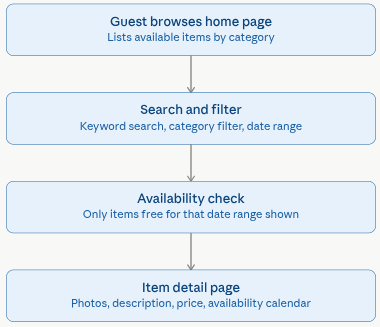
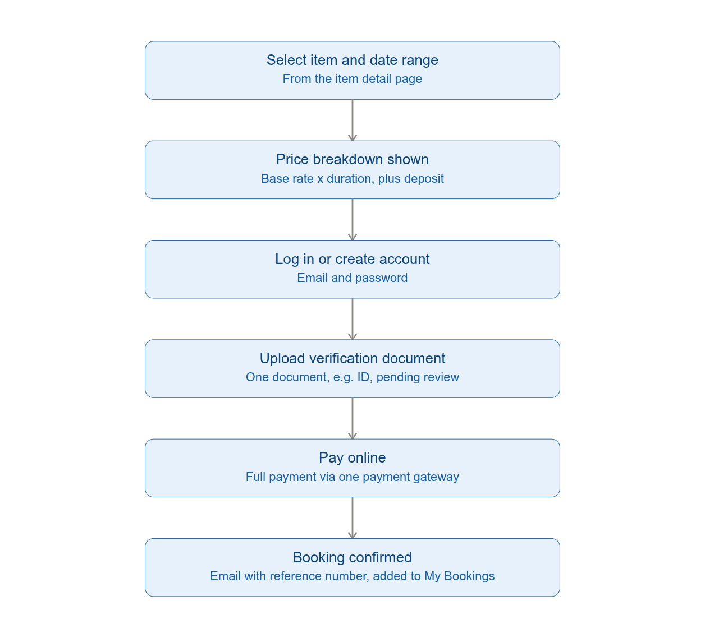
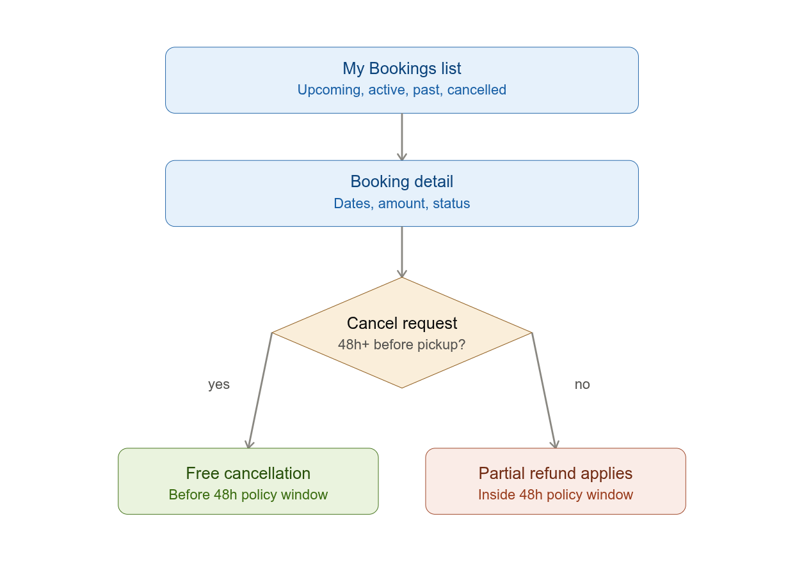
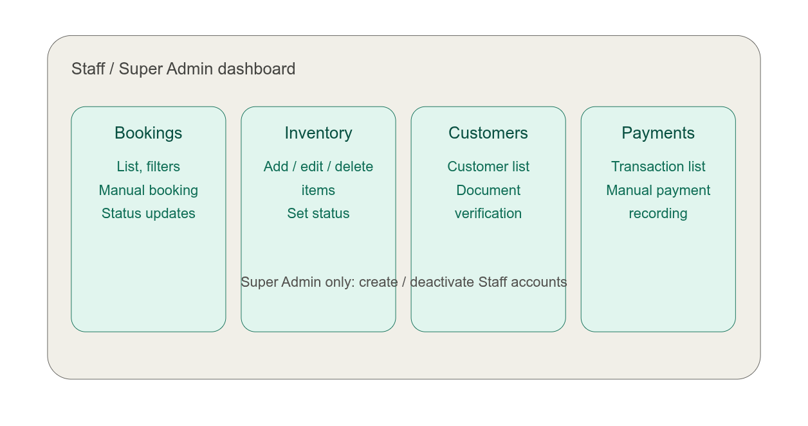

# RentEase — MVP Specification

*This document is a full rewrite of the original RentEase project specification, scoped down to a Minimum Viable Product: the smallest version that lets a customer browse, book, and pay online, and lets staff manage that booking end-to-end, while proving out the core "no double-booking" value proposition. Every feature and table not required to hit that goal has been moved to a clearly marked Phase 2/3 backlog rather than deleted, so nothing from the original plan is lost.*

---

## 1. Business Background

We run a rental company that rents out physical items to customers — vehicles, equipment, or property (this scenario is generic; naming can be adapted for the specific rental domain). Bookings currently happen over phone/WhatsApp, causing double-bookings and no central record. The MVP replaces that with a single source of truth for availability and bookings.

---

## 2. MVP Goal

One goal, above all others, defines the MVP: stop double-bookings by giving customers real-time availability and a self-service booking + payment flow, and giving staff one place to see and manage those bookings. Everything below is scoped to serve that single goal.

- Customers can browse available items, check real availability, and book/pay online.
- Staff can view bookings, confirm/cancel them, and record payments from one dashboard.
- Mobile-friendly, since most customers browse on their phones.

> **Deferred (not MVP):** Owner-facing analytics/reporting, utilization dashboards, and overdue-item alerts — worth building once there's real booking volume to report on.

---

## 3. User Roles (MVP)

| Role | Description |
|---|---|
| **Guest** | Anyone browsing the public site without an account. Can search/browse listings. |
| **Customer** | Registered user. Can book, pay, view booking history, cancel (within a simple fixed policy). |
| **Staff** | Single combined role for MVP: confirms/cancels bookings, manages inventory, records payments. (Booking Agent, Inventory Manager, and Finance are merged into one role — see note below.) |
| **Super Admin (Owner)** | Full access, including creating additional staff accounts. |

> **Deferred (not MVP):** Splitting Staff into separate Booking Agent / Inventory Manager / Finance / Admin roles with different permissions — a fixed "staff vs. owner" split is enough until you have more than a couple of staff members.

---

## 4. Customer-Facing Website — MVP Requirements

### 4.1 Browsing & Search

- Home page listing available items.
- Category filter and a simple keyword search.
- Availability search: customer picks a date range and only sees items free for that window.
- Item detail page: photos, description, price, and a live availability calendar.

**Customer discovery flow** 

> **Deferred (not MVP):** Autocomplete search, location/branch filters, price-range/capacity filters, promotions/featured items, reviews/ratings display.

### 4.2 Booking Flow

- Customer selects item + date range.
- System shows price breakdown: base rate × duration + deposit.
- Customer logs in or creates an account (email + password).
- Customer uploads one verification document (e.g., ID).
- Payment: full payment online via one payment gateway (e.g., Stripe).
- Booking confirmation page + confirmation email with a booking reference number.
- Booking appears in the customer's "My Bookings" list.

**Booking and checkout flow**

> **Deferred (not MVP):** Add-ons (insurance, delivery, extra driver), partial deposit + pay-remainder-on-pickup, social login, local payment wallets, SMS confirmations.

### 4.3 Customer Account Area

- My Bookings: upcoming, active, past, cancelled — with status.
- Booking detail: view dates, amount, status.
- Cancel request, subject to one simple fixed policy (e.g., free before 48h).

**Customer account and cancellation**

> **Deferred (not MVP):** Downloadable contract/invoice PDFs, handover/return condition photos, saved payment methods, support chat/tickets, notification preferences, loyalty/discount codes.

### 4.4 Other Public Pages

- About Us, Terms & Conditions, Privacy Policy, Contact Us — static pages.

> **Deferred (not MVP):** Branch map, reviews/testimonials pages.

---

## 5. Admin Dashboard — MVP Requirements

### 5.1 Dashboard Home

- Simple list: today's pickups, today's returns, active rentals.

> **Deferred (not MVP):** Revenue widgets, occupancy/utilization rates, overdue alerts, low-availability alerts, expiring-document alerts.

### 5.2 Inventory Management

- Add/edit/delete rental items: name, category, description, photo(s), single base price, status (available, rented, maintenance, retired).

> **Deferred (not MVP):** Seasonal/weekend/long-term pricing rules, maintenance scheduling with cost logs, bulk CSV import.

### 5.3 Booking Management

- Booking list with filters: status, date range.
- Manual booking creation (for phone/walk-in customers).
- Booking detail page: dates, customer, item, status, payment status.
- Staff can change booking status: confirmed → active → completed / cancelled.

> **Deferred (not MVP):** Full calendar view with drag-to-reschedule, handover/return checklists with photos, damage flagging, late-fee automation, deposit refund workflow.

### 5.4 Customer Management

- Customer list with search and booking history.
- Document verification: approve/reject uploaded ID.

> **Deferred (not MVP):** VIP/blacklist flags, CRM tags, communication log, support ticketing.

### 5.5 Payments

- Transaction list: payments and their status.
- Manual payment recording (cash/bank transfer) for offline payments.

> **Deferred (not MVP):** Refund workflow automation, invoice PDF generation, revenue/exportable reports.

### 5.6 Staff & Roles

- Super Admin can create/deactivate Staff accounts.

> **Deferred (not MVP):** Branch assignment, granular per-role permissions, full audit log UI (the underlying audit_logs table is still captured — see Section 7 — just no admin screen for it yet).

### 5.7 Content & Settings

> **Deferred (not MVP):** Entire section deferred: homepage banners/promotions, multi-branch/business-hours management, configurable cancellation/refund rules, tax/fee configuration, notification template editor. MVP hardcodes a single cancellation policy and tax rate in application config.

---

## 6. Non-Functional Requirements (MVP)

- Responsive design: mobile-first.
- Performance: availability check should return in under 1–2 seconds.
- Security: HTTPS everywhere, tokenized payments via the payment gateway (never store raw card data), role-based access control (Customer / Staff / Super Admin only).
- Backups: automated daily database backups.

> **Deferred (not MVP):** 99.5%+ formal uptime SLA, multi-language support, formal audited change-log UI, horizontal scale-out for multi-branch — all reasonable to defer until there's real traffic to justify the engineering cost.

---

## 7. Database Design (MVP Schema)

Eleven tables — enough to fully support Sections 4 and 5 above, and nothing more. Everything else from the original/full design (item_pricing_rules, handover_reports, return_reports, maintenance_logs, invoices, discount_codes, promotions, cancellation_policies, tax_fee_config, notification_templates, notifications_log, reviews, support_tickets) is deferred to Phase 2/3 — see Section 9.

#### users

| Column | Description |
|---|---|
| id | PK |
| full_name | Text |
| email | Unique |
| phone | Text |
| password_hash | Text |
| role | Enum: customer, staff, super_admin |
| is_verified | Boolean |
| created_at / updated_at | Timestamps |

#### branches

| Column | Description |
|---|---|
| id | PK |
| name / address / city | Text |
| phone | Text |
| is_active | Boolean |

#### categories

| Column | Description |
|---|---|
| id | PK |
| name / description | Text |

#### item_catalog

*The product itself — one row per distinct rentable product, independent of how many physical units exist or which branches stock it.*

| Column | Description |
|---|---|
| id | PK |
| category_id | FK → categories |
| created_at / updated_at | Timestamps |

#### items

#### items

*A physical, bookable unit of a catalog product, located at one branch. This is what a booking actually reserves.*

| Column | Description |
|---|---|
| id | PK |
| catalog_id | FK → item_catalog |
| branch_id | FK → branches |
| name | Text |
| description | Text |/home/chamodhi/Downloads/01_schema.sql
| base_price_daily | Decimal |
| deposit_amount | Decimal |
| status | Enum: available, rented, maintenance, retired |
| created_at / updated_at | Timestamps |

#### item_photos

| Column | Description |
|---|---|
| id | PK |
| catalog_id | FK → item_catalog *(photos represent the product, not an individual physical unit)* |
| url | Text |
| sort_order | Integer |

#### bookings

|---|---|
| id | PK |
| booking_reference | Unique, human-readable |
| customer_id | FK → users |
| item_id | FK → items *(the specific physical unit being rented)* |
| branch_pickup_id / branch_dropoff_id | FK → branches |
| start_datetime / end_datetime | Timestamp |
| status | Enum: pending, confirmed, active, completed, cancelled |
| base_amount / tax_amount / deposit_amount / total_amount | Decimal |
| created_at / updated_at | Timestamps |

#### booking_status_history

| Column | Description |
|---|---|
| id | PK |
| booking_id | FK → bookings |
| old_status / new_status | Enum |
| changed_by | FK → users |
| changed_at | Timestamp |

*Kept in the MVP even though it's not customer-facing: it's cheap to add now and directly protects the core "no double-booking" goal by giving you a trail if a status ever looks wrong.*

#### payments

| Column | Description |
|---|---|
| id | PK |
| booking_id | FK → bookings |
| type | Enum: payment, refund |
| amount | Decimal |
| method | card, cash, bank_transfer |
| gateway_reference | Text, nullable |
| status | pending, success, failed |
| created_at | Timestamp |

#### documents

| Column | Description |
|---|---|
| id | PK |
| user_id | FK → users |
| document_type | id_card, license, other |
| file_url | Text |
| verification_status | pending, approved, rejected |
| reviewed_by | FK → users, nullable |
| created_at | Timestamp |

#### audit_logs

| Column | Description |
|---|---|
| id | PK |
| actor_id | FK → users |
| action | Text, e.g. "booking.status_changed" |
| entity_type / entity_id | e.g. "booking", 1042 |
| created_at | Timestamp |

*Trimmed version — old_value/new_value JSON diffing deferred; log the action and who/when for now.*

### 7.1 Availability Check Logic

Unchanged core logic: to check if an item is available for a date range, exclude any item with a booking in status (pending, confirmed, active) whose start_datetime/end_datetime overlaps the requested range. Index on (item_id, start_datetime, end_datetime). No maintenance-window join needed yet — a staff member can just set item.status = 'maintenance' to pull an item out of search entirely.

---

## 8. Tech Stack (MVP)

- Backend: FastAPI + PostgreSQL — matches your existing stack, no new tools to learn.
- Frontend: Next.js for the customer site; a simple React admin panel (can even be a second set of routes in the same Next.js app for MVP).
- File storage: S3-compatible storage (or MinIO, given your existing familiarity) for photos and documents.
- Payments: Stripe (test mode is enough for MVP demo purposes).
- Hosting: a single Docker Compose deployment on one VM/EC2 instance is enough — no need for orchestration yet.

> **Deferred (not MVP):** Celery/Redis background jobs, SES/SendGrid or Twilio integrations, multi-container orchestration, read replicas — add these when a real feature needs them, not preemptively.

---

## 9. Phased Delivery Plan

### MVP (this document)

Sections 4–7 above: browse/search, availability check, booking + payment, customer account; admin inventory CRUD, booking list, manual booking, basic payment recording.

### Phase 2 — Operations

item_pricing_rules, handover_reports/return_reports with photos, maintenance_logs, invoices, support_tickets, staff role granularity, branch assignment, full audit log UI.

### Phase 3 — Growth

reviews, discount_codes, promotions, cancellation_policies, tax_fee_config, notification_templates, notifications_log, multi-language, advanced reporting/analytics.

---

## 10. Open Questions

- What rental domain exactly (vehicles / equipment / property) — affects field naming and document requirements.
- Expected inventory size and booking volume at MVP launch — confirms a single VM is sufficient.
- Which payment gateway is actually available/compliant in your target region for a real (non-test) launch.

---

**— End of MVP specification —**

